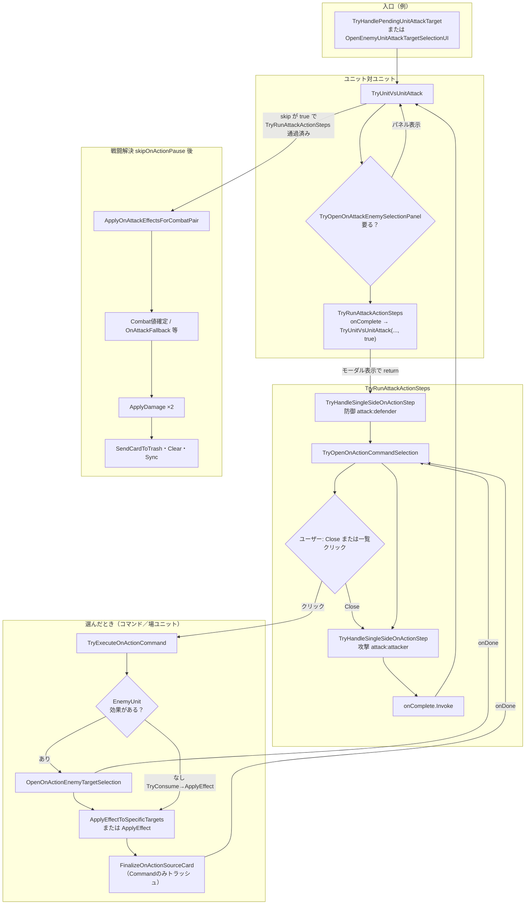

# ユニット攻撃〜OnAction〜戦闘解決（メソッドフロー）

VS Code / Cursor でこのファイルを開き、プレビューで Mermaid を表示してください。

- **推奨拡張**: [Markdown Preview Mermaid Support](https://marketplace.visualstudio.com/items?itemName=bierner.markdown-mermaid)  
  （または標準の Markdown プレビューが Mermaid に対応している環境でも可）

プレビュー: `Ctrl+Shift+V`（Windows） / 右上のプレビューアイコン

---

## プレイヤー・ユニット攻撃〜OnAction〜相互ダメージ

---

## シールド攻撃（参考）

`TryUnitVsUnitAttack` の代わりに **`TryUnitShieldAttackFromUnit`** が入口。  
`TryRunAttackActionSteps` の `onComplete` は **`TryUnitShieldAttackFromUnit(attacker, true, true)`**。  
続きは **`gundamRule.TryApplyUnitShieldAttack`** → `TriggerCardEffects(OnAttack)` 等（ユニット同士の相互 `ApplyDamage` はなし）。

---

## メソッド早見（ユニット攻撃）

| 段 | メソッド |
|----|----------|
| 入口 | `TryHandlePendingUnitAttackTarget` / `OpenEnemyUnitAttackTargetSelectionUI` |
| 中核 | `TryUnitVsUnitAttack` |
| OnAttack選択 | `TryOpenOnAttackEnemySelectionPanel` |
| アクション | `TryRunAttackActionSteps` → `TryHandleSingleSideOnActionStep` → `TryOpenOnActionCommandSelection` |
| 効果適用 | `TryExecuteOnActionCommand` → `OpenOnActionEnemyTargetSelection`（任意）→ `ApplyEffect` / `ApplyEffectToSpecificTargets` |
| 再開 | `onComplete` → `TryUnitVsUnitAttack(..., true)` |
| 解決 | `ApplyOnAttackEffectsForCombatPair` → `ApplyDamage` |
